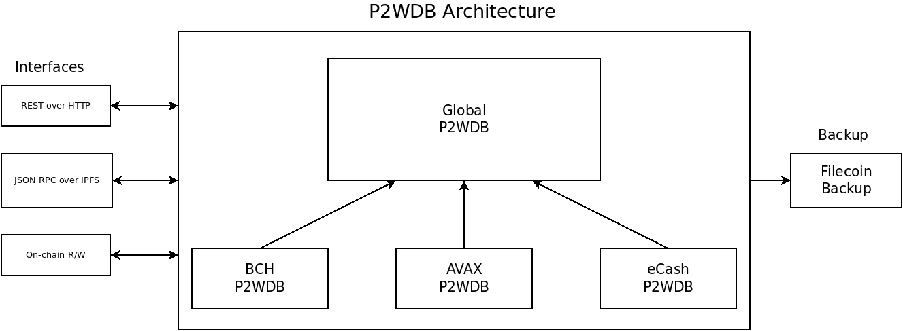

# ipfs-p2wdb-service

 

## What Is P2WDB?

- [YouTube Video Overview of the P2WDB Project](https://youtu.be/korI-8W240s)

P2WDB is an acronym for pay-to-write database. It's a peer-to-peer (p2p) databse that operates similarly to a blockchain. It solves two growing problems in the blockchain space:

- **On-chain data** - Blockchains can be thought of as censorship resistant databases. They are great at censorship resistance, but they are really bad at being databases. On-chain data 'bloat' or 'state management' is one of the hardest scaling problems in the blockchain space. The P2WDB helps blockchains scale by providing a place to move data off-chain, but still be able to access that data on-chain.

- **Cross-chain communication** - Blockchains are like islands or silos. They are isolated from one another and can not easily communicate with one another. This leads to tribalism and a mentality of a zero-sum game. The P2WDB is a cross-chain communication medium. An event on one chain can be communicated and effect a smart contract on another chain.

The architecture of the database is broken up into three major sections:

- Interfaces
- P2WDB Architecture
- Backup

### Interfaces

There are three primary communication interfaces for a P2WDB:

- **REST API over HTTP** is the modern way that web 2.0 apps communicate with one another. It's fast and efficient, but it's also centralized and easy to censor. It's important to provide this interface so that the P2WDB can be accessed by web apps or phone apps.

- **JSON RPC over IPFS** is a censorship resistant replacement for the REST API. It's a little slower, but this interface can be accessed by web apps and phone apps while being able to easily tunnel through firewalls and thereby prevent attempts at censorship.

- **On-Chain Read and Write** is the most censorship resistant, but also the most expensive. Interfaces will be built for each blockchain that allows reading and writing to the database directly on-chain.

### P2WDB Architecture

Each blockchain will have its own P2WDB instance that is specific to that blockchain. The local P2WDB can be written-to by providing a proof-of-burn on that blockchain. A proof-of-burn is simply a transaction ID (TXID), where a specific quantity of a specific token (e.g. 0.01 [PSF tokens](https://psfoundation.cash)) was burned in that transaction. That is the 'ticket' that lets a user write new data to the database. Anyone can read from the database.

All the local P2WDBs will feed into a global P2WDB, which will be blockchain agnostic. This does not require any effort on the users part. Any data written to a local P2WDB will be automatically added to the global P2WDB. In this way, the P2WDB can function as a cross-blockchain communication medium and data provider.

### Backups

Because the P2WDB is based on [IPFS](https://ipfs.io) and [OrbitDB](https://orbitdb.org/), anyone at any time can backup the database onto [Filecoin](https://filecoin.io). 'Official' snapshots will be taken once every three months.

Smaller databases make decentralization and censorship resistance better. For this reason, future plans include the creation of a new global P2WDB every year. Previous years databases will be backed up on Filecoin, with access over IPFS. Archival access will be a secondary service.

Keeping the P2WDB small and nimble ensures it's easy to replicate by many service providers. The more service providers participating in the ecosystem, the more censorship resistant the data becomes.

## About This Repository

This is a fork of [ipfs-service-provider](https://github.com/Permissionless-Software-Foundation/ipfs-service-provider). This project ports the pay-to-write (P2W) database (DB) code from [this older project](https://github.com/Permissionless-Software-Foundation/pay-to-write-orbitdb) and adds it to the ipfs-service-provider boilerplate code in order to add both a REST API over HTTP interface and JSON RPC over IPFS interface to access the P2WDB services.

Two API endpoints are currently implemented:

- Write - add an entry to the database.
- Read all - read all entries in the database.

Each endpoint is available over two interfaces:

- A REST API over HTTP
- A JSON RPC over IPFS, using [chat.fullstack.cash](https://chat.fullstack.cash)

Documentation:

- [API documentation for both interfaces can be found here.](https://p2wdb.fullstackcash.nl/)
- [Example code for burning tokens and writing data to the DB.](./examples)
- [Developer Documentation and Architectural Overview](./dev-docs)
- [Next Steps for this project](./dev-docs/next-steps.md)

This project is under heavy development and is only appropriate for use by JavaScript developers familiar with REST API or JSON RPC development.

## Setup Development Environment

The development environment is assumed to be Ubuntu Linux.

- Clone this repository.
- Install dependencies with `npm install`
- If MongoDB is not installed, install it by running the `./install-mongo.sh` script
- Run tests with `npm test`
- Start with `npm start`

## Docker container

The target production deployment of this software is as a Docker container. The [docker folder](./docker) contains the Dockerfile and `docker-compose.yml` file to generate a new Docker image. The production target is Ubuntu Linux 20.04, running Docker and Docker Compose.

- Generate a new Docker image: `docker-compose build --no-cache`
- Start the Docker container: `docker-compose up -d`
- Stop the Docker container: `docker-compose down`

The MongoDB container creates a new directory, `mongodb`. You'll need to delete this directory if you want to re-build the Docker image for the P2WDB.

## License

[MIT](./LICENSE.md)
