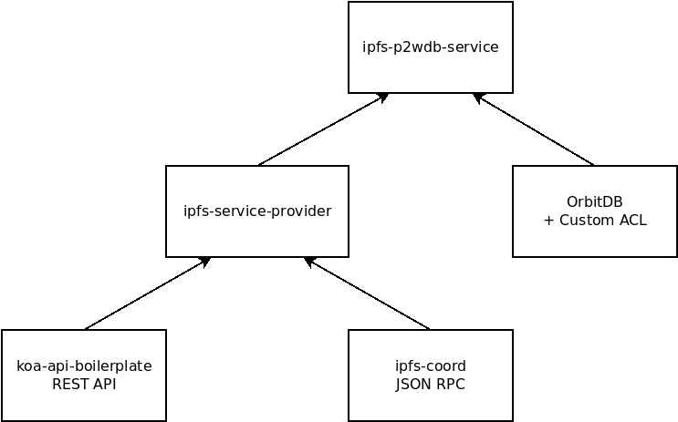

# Developer Documentation

This directory contains Markdown documents which describe the architecture of the pay-to-write database (P2WDB). The one-sentence description of the P2WDB is: "a peer-to-peer database that requires proof-of-burn in order to add entries to the database". The documents in this directory serve to expand on that statement, and describe all the subcomponents that go into that idea.

## OrbitDB

[OrbitDB](https://github.com/orbitdb/orbit-db) is a peer-to-peer (p2p), append-only 'database' that runs on top of [IPFS](https://ipfs.io), using [pubsub channels](https://docs.libp2p.io/concepts/publish-subscribe/). This software is at the heart of the P2WDB concept. Understanding what OribitDB is and how it works is essential to understanding the P2WDB.

The biggest change that P2WDB makes is to add a custom [Access Control Library](https://github.com/orbitdb/orbit-db-access-controllers) (ACL) to OrbitDB. This ACL requires that users submit a proof-of-burn in order to write data to the database. Anyone can read from the database.

The ACL rules become part of the hash for the database name. If a malicious user attempts to re-write the ACL rules for their instance of the P2WDB, they will only succeed in creating a new database. Their node will be isolated and other nodes running the consensus version of the database will not recognize it.

## Proof-of-Burn

The 'big innovation' in this project is to combine OrbitDB with a proof-of-burn to control database writes. The proof-of-burn is simply a transaction ID (TXID) on a blockchain. Each independent copy of the P2WDB will evaluate this transaction and verify that the transaction involves burning a specific quantity of a specific token. If those criteria are met, then the user is allowed to write data to the database. Otherwise the write request is rejected. Each instance of the P2WDB independently validates these write entries, similar to nodes on a blockchain.

Right now the Bitcoin Cash (BCH) blockchain is used for the proof-of-burn, but one goal of this project is to expand the proof-of-burn to other blockchains, including [Avalanche](https://www.avax.network/) and [eCash](https://e.cash). Implementing interfaces for different blockchains will allow the P2WDB to become a medium for cross-blockchain communication. For example, an event on one blockchain could trigger a smart contract or Script on another blockchain.

Currently, the proof of burn requires 0.01 [PSF tokens](https://psfoundation.cash) burned in order to write (up to) 10KB of text data to the database. These numbers will probably change in the future, but these are what is currently implemented. [Example scripts](../examples) are provided to help developers interact with the database.

## P2WDB API & RPC

There are two network interfaces for the P2WDB:

- REST API over HTTP
- JSON RPC over IPFS

The REST API is based on this [koa boilerplate](https://github.com/christroutner/koa-api-boilerplate). It allows the P2WDB to be interfaced with conventional Web 2.0 technology. It's expected that the P2WDB will be bundled with additional software, probably using Docker containers. The REST API provides a great way for orchestrated software to communicate, both via intranet or internet.

The JSON RPC is based on the [ipfs-coord](https://github.com/Permissionless-Software-Foundation/ipfs-coord#readme) library. This library uses IPFS pubsub channels to allow new IPFS nodes to quickly find one another and establish an end-to-end encrypted (e2ee) connection. They can then exchange data by passing JSON RPC commands. The JSON RPC is immediately accessible to developers by using [chat.fullstack.cash](https://chat.fullstack.cash) and the JSON RPC commands listed in the [API documentation](https://p2wdb.fullstackcash.nl/).

Both interfaces are maintained in the [ipfs-service-provider](https://github.com/Permissionless-Software-Foundation/ipfs-service-provider) repository, and are not directly maintained in this ipfs-p2wdb-service repository. Instead, changes around the interfaces are either pushed or pulled from the upstream ipfs-service-provider repository.

Reads and writes to the P2WDB can be accomplished via REST API over HTTP or JSON RPC over IPFS. Which one is preferable depends on the use-case.

## Dependencies

This ipfs-p2wdb-service repository is evolved from several other previous projects. Instead of maintaining a separate fork, code is frequently pulled down from the upstream repositories. Here is the software dependency tree for the software stack making up the P2WDB interfaces:

Here are the repositories listed in the diagram:

- [OrbitDB](https://github.com/orbitdb/orbit-db)
- [OrbitDB Access Control Library](https://github.com/orbitdb/orbit-db-access-controllers)
- [ipfs-service-provider](https://github.com/Permissionless-Software-Foundation/ipfs-service-provider)
- [ipfs-coord](https://github.com/Permissionless-Software-Foundation/ipfs-coord)
- [koa-api-boilerplate](https://github.com/christroutner/koa-api-boilerplate)

## Blockchain Interfaces

In addition to the REST and JSON interfaces, on-chain interfaces are planned to be developed for each supported blockchain. For example, on the Bitcoin Cash blockchain, a communication protocol using the OP_RETURN will be developed for reading and writing to the database, directly on-chain.

This would allow on-chain oracles to be driven by entries to the P2WDB. It would allow on-chain applications on one blockchain to pass data to another on-chain applications on their blockchain and on other blockchains.

This would make it much more pragmatic for applications to use pruned nodes instead of archival nodes. Archival nodes maintain a full copy of the blockchain (200GB and growing for BCH). Archival nodes have onerous data requirements and long sync times. Moving application data to an external but accessible database, makes blockchain technology much more scalable.

## Clean Architecture

The architecture of the code in this repository attempts to follow the ideas behind [Clean Architecture](https://youtu.be/CnailTcJV_U). Code is split up into four groups:

- Entities
- Use Cases
- Adapters
- Controllers

Without knowing the patterns and reasoning behind Clean Architecture, the code in this project will look 'weird' to most JavaScript developers. This is because Clean Architecture comes from outside the JavaScript world and some of it's core ideas (like dependency inversion) don't translate easily into JavaScript.

Clean Architecture solves two key problems is application design:

- It manages increasing complexity as new features and interfaces are added over time.
- It provides defense against [code rot](https://en.wikipedia.org/wiki/Software_rot) by isolating the parts that rarely change from the parts that change frequently.

For additional details on Clean Architecture and how it applies to this project, see the [Clean Architecture document](./clean-architecture.md)

## Repercussions of this Technology

Once the basic components are understood, it's possible to take a step back and assess the repercussions of this technology. The P2WDB functions in a similar manner to a blockchain, but without a lot of the overhead and cost that blockchains incur. Here are just a few applications that can be unlocked by the P2WDB technology:

- Cross-blockchain communication
- The [SLP token specification](https://github.com/simpleledger/slp-specifications/blob/master/slp-token-type-1.md) could be ported to create a single token protocol that is accessible by multiple blockchains.
- Oracles on one chain can trigger a smart contract or Script on another blockchain.
- Uncensorable, community-driven marketplaces. An uncensorable version of [Craigslist](https://craigslist.org) for example. Or a decentralized exchange (DEX) for trading cryptocurrencies.

This idea compliments blockchains by creating a much more flexible and scalable data layer. Because it rides on the IPFS network, databases can be archived on Filecoin. Subnetworks can shard the P2WDB by creating a new database for their use, then merging any needed data to the main database. This is similar to a side-chain in Bitcoin or a subnetwork in Avalanche.
